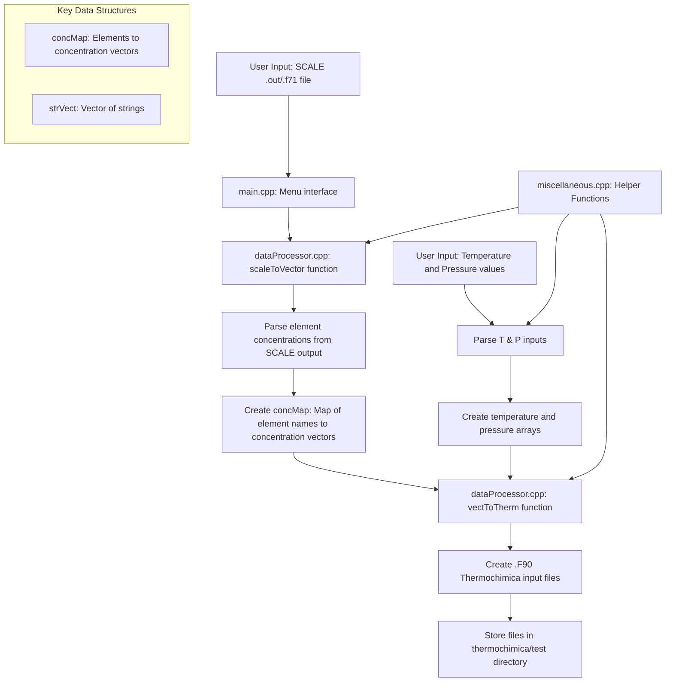
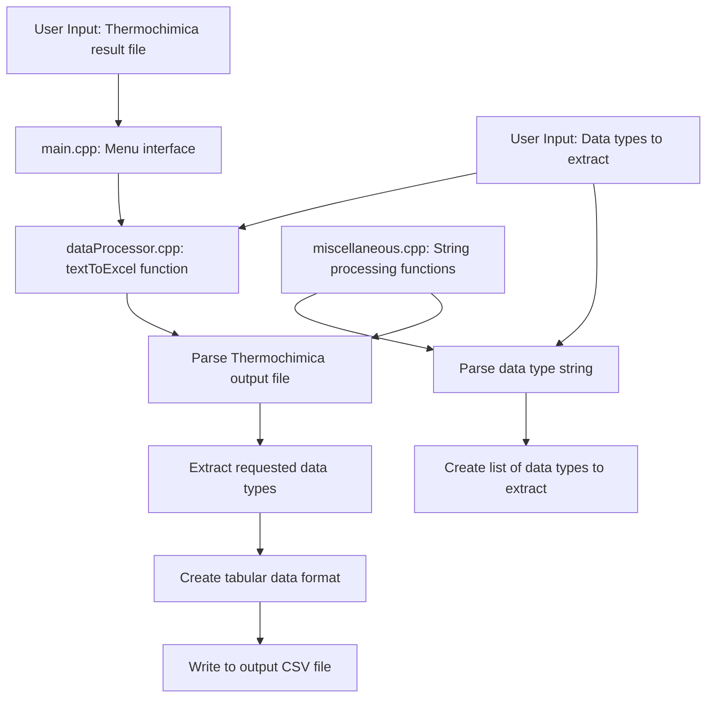
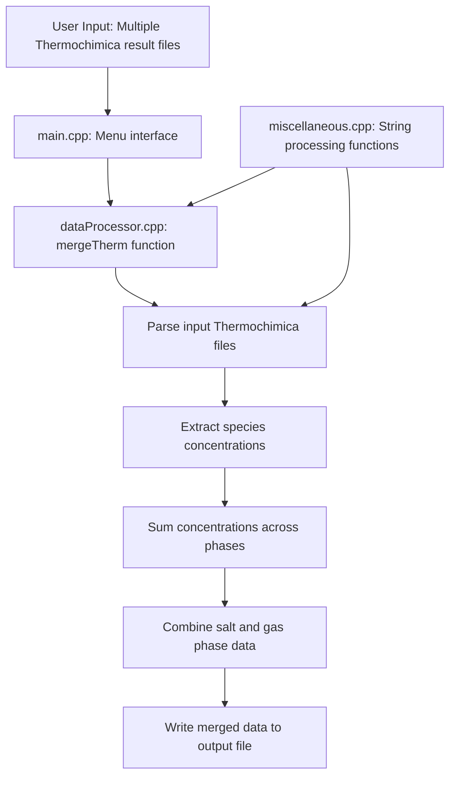
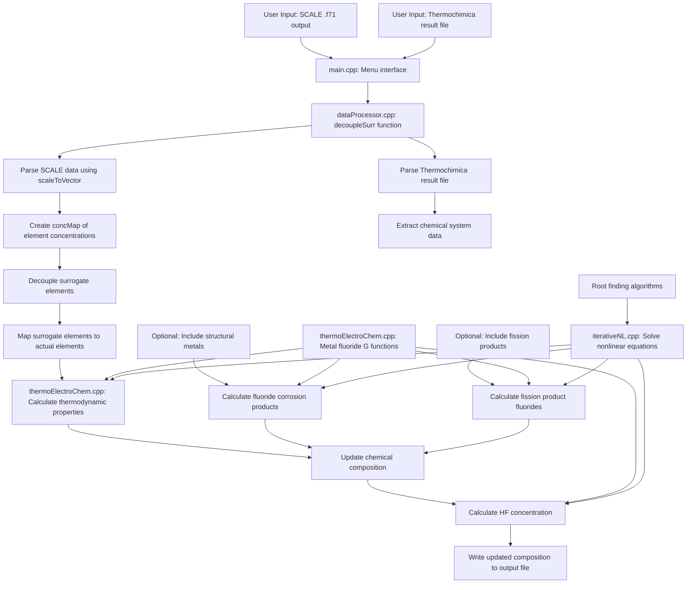

# Read Me
This is the entirety of the code I used to update the molten salt's chemical composition. SCALE and Thermochimica is required. See [this page](https://github.com/ORNL-CEES/thermochimica) for installing Thermochimica.

## Using the code
All code files are under the dataProcessor folder. Most of them are numerical methods file that Dr. Pencheva and I wrote while in M 348 and M 368K (I wasn't able to install a library). 

The project can be compiled in any way you'd like. There should be a new executable file if compilation is sucessful. I liked to copy that executable file (named ``dataProcessor.exe``) to the ``thermochimica`` directory so I could run both my code and Thermochimica on Ubuntu. If the executable file cannot be opened on Ubuntu, because of a denied permission, enter
```
chmod u+x ./dataProcessor.exe # or however it is named
```
The program should look like this:


It has 4 options:

* Option 1: Convert a SCALE output file (table of element from a .out file) into multiple TC input files, with each file representing the system at one time instance. The sample SCALE output file is shown in ``sample_problem/msr_isotopics.out``. The system temperature (in K) and pressure (in atm) are also needed. Multiple values for temperature and pressure can also be inputted, separated by a whitespace ( ) or a comma (,). Another option for inputting temperature or pressure is to use a linearly spaced in the format of start:stop or start:stop:step (separated by colons). The start:stop format will compute the step size depending on how many time intervals are present in the current system, while the start:stop:step will use the user-specified step size. The array includes start but excludes stop (so "100:150:10" means an array of "100 110 120 130 140", while "100:151:10" means "100 110 120 130 140 150"). Finally, the TC input files have the .F90 ending and should be put in the ``thermochimica/test`` directory.
* Option 2: Extract numerical data from one or multiple Thermochimica results and arrange them in table format. The accepted quantities are the total moles of ions (ni), total moles of salt (nx), total moles of gas (ny), temperature (T), mole fraction of species ABC in the salt (x_ABC), and mole fraction of species ABC in the gas (y_ABC). For example, entering "nx x_UF3 x_UF4 y_UF5" will create a table with the total moles of salt, the mole fractions of UF3 and UF4 in the salt, and the mole fraction of UF5 in the gas as a function of time.
* Option 3: Merge two TC output files into one. This function has not been updated, but is left in the code as it may be useful in future projects.
* Option 4: Decouple surrogate elements into the chemically similar elements not accounted for by MSTDB (for example, Ca into Ca, Ba, and Sr). This function requires a SCALE .F71 output (just as Option 1) and a TC result file. Optionally, it can also perform thermochemical calculations of corrosion products (Cr, Fe, and Ni) as well as HF concentration. This requires a slight modification in the .F71 file, so that the entries under Cr, Fe, and Ni represent the mole fraction of the respective metal in the alloy (as opposed to amounts in moles). The result file will be in a similar format as a TC output, so that data can be extracted through Option 2.

## Sample problem
The following sample aims to demonstrate the steps needed to solve for the chemical composition of the MSR system. All necesarry files are under the ``sample_problem`` folder. The reactor core in the sample system is 5% UF4 in 2LiF-BeF2. The uranium is enriched to 20 weight-% U-235 and the lithium to 99.99 mol-% Li-7. The material specification portion of the SCALE input file should be:

```
    mat{
        units = MOLES
        iso = [li6 = 0.00633
               li7 = 63.32367
               be9 = 31.78905
               f19 = 146.67
               u235 = 0.98989
               u238 = 4.01011]
        }
 ```
The complete input code is shown in the ``msr_isotopics.inp`` and will need to run on MSRR_ContinuousDepletion library.

Once the .inp file has been run, a new result file with the .f71 extension is created and opened by SCALE. The following modifications must be carried out under the Table tab in order to obtain useful chemical data.


Copy the table to Excel and crop out the "Subtotals" and "Totals" columns. If needed, the values of the elements Cr, Fe, Co, Zn and Mo in the structural metal alloy can be included (should be the same throughout the irradiation time). See ``F71_output.txt`` for the file format. Note that the last three columns of the file represent the elements Cu, Fe, and Ni. If any of these elements are present in previous columns (possibly because [nrank] has been set too high), then that column will have to be deleted.

Run dataProcessor.exe and select Option 1 to convert ``F71_output.txt`` into TC input files. It has 184 intervals so there should be 184 TC input files created, the first five of which (named ``TC_input1.F90`` through ``TC_input5.F90``) are under the ``sample_problem`` folder. On the local machine, those .F90 files must be under the ``thermochimica/test`` directory.

The following code can be used to run TC on all the input files and have the results printed out in one single result file named ``TC_first_results.txt``:
```
make
for i in $(seq 1 1 184) # the last number should be how many TC input files there are
do
./bin/TC_input$i >> TC_first_results.txt
done
```
Run data.Processor.exe and select Option 4 on ``TC_first_results.txt`` to decouple the surrogate elements into the actual elements they represent. Optionally, it can also calculate fission products and HF composition. These results are stored under ``TC_final_results.txt``.

Then select Option 2 on ``TC_final_results.txt`` to extract any value of interest. For example, if I want to know the concentration of UF3 and UF4 over time, the string parameter is "x_UF3 x_UF4". The extract data are under ``TC_extract.cvs``. Noted that the time variable is missing so that has to be manually included.

Note that there are other columns besides these two in the string, namely "x_U2F8", "x_U[VI]-F4, and x_U[VII]-F4. The latest version of MSTDB-TC counts UF4 as these three diferent molecules, so the concentration of UF4 is virtually the sum of U[VI]-F4, U[VII]-F4, and two times U2F8. Result files created from Option 4 only includes UF4 under a single category.

## Concept Mapping the Code 


## Option 1: Convert SCALE Output to Thermochimica Input Files



## Option 2: Extract Data from Thermochimica Output



## Option 3: Merge Thermochimica Output Files



## Option 4: Decouple Surrogate Elements



## Detailed Process Description for Each Option

### Option 1: Convert SCALE Output to Thermochimica Input
1. The user provides a SCALE output file containing element concentrations and specifies temperature and pressure values.
2. The `scaleToVector` function parses the SCALE output file, extracting element names and their concentration vectors over time.
3. The data is organized into a `concMap` (a map of element names to concentration vectors).
4. Temperature and pressure inputs are parsed using string processing functions from `miscellaneous.cpp`.
5. The `vectToTherm` function takes the concentration data and temperature/pressure values to generate Thermochimica input files (.F90).
6. The input files are created for each time step and stored in the thermochimica/test directory.

### Option 2: Extract Data from Thermochimica Output
1. The user provides a Thermochimica result file and specifies which data types to extract (e.g., "x_UF3 x_UF4").
2. The `textToExcel` function parses the input string to identify the requested data types.
3. It then scans the Thermochimica output file to extract the corresponding values.
4. The data is organized into a tabular format with each column representing a data type.
5. The extracted data is written to an output CSV file for further analysis.

### Option 3: Merge Thermochimica Output Files
1. The user provides multiple Thermochimica result files.
2. The `mergeTherm` function reads each file and extracts species concentrations from both salt and gas phases.
3. It combines the data by summing concentrations across files for corresponding species.
4. The merged data is written to a new output file that consolidates all the input data.

### Option 4: Decouple Surrogate Elements
1. The user provides a SCALE output file and a Thermochimica result file.
2. The `decoupleSurr` function first calls `scaleToVector` to extract element concentrations from the SCALE file.
3. It then parses the Thermochimica result file to get the current chemical system state.
4. Using `surrogateMap` and `surrogateMapInv` from `thermoElectroChem.h`, it decouples surrogate elements into their actual constituents.
5. Optionally, it can calculate:
   - Fluorides of structural metals (Cr, Fe, Ni) using thermodynamic functions from `thermoElectroChem.cpp`
   - Fission product fluorides
   - HF concentration
6. These calculations involve solving nonlinear equations using functions from `iterativeNL.cpp` and `rootFinding.cpp`.
7. The updated chemical composition is written to an output file in a format similar to Thermochimica output.

Each option relies on a combination of data processing functions, numerical methods, and thermodynamic calculations to transform and analyze the molten salt reactor data.
